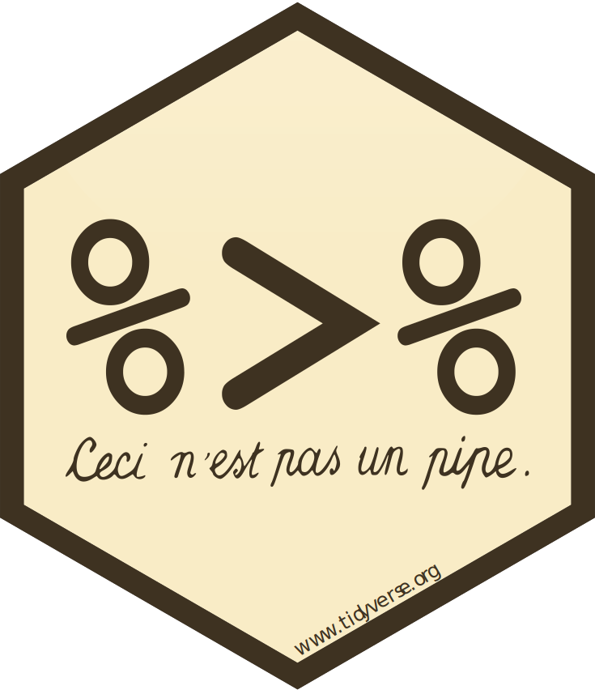
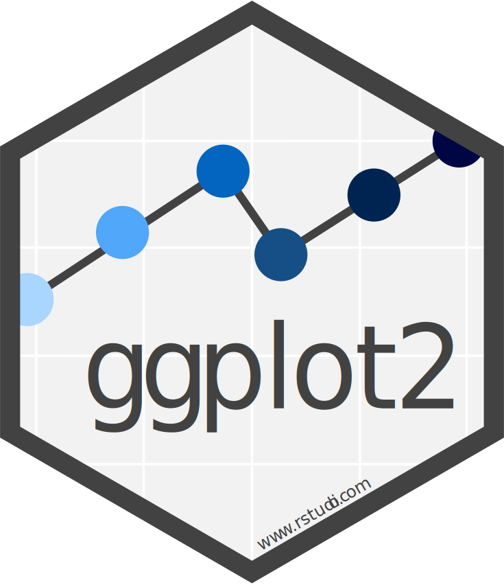

```{r setup, include=FALSE}
options(htmltools.dir.version = FALSE)
knitr::opts_chunk$set(dpi=150, out.width = "45%")
source("Major_XR_3/02_PlotScript_w.R")
```


# Tidyverse
Tidyverse is a collection of packages based on the same styling under the **Grammar of Data Manipulation**.  
A function is a **verb** it does something to arguments
.pull-left[
- web page:    https://www.tidyverse.org/
- style guide: https://style.tidyverse.org/index.html
]

.pull-right[
<div align="center">

</div>

]
---
# Tidyverse

<style type="text/css">
#topright {
    position: absolute;
    right: 0;
    top: 0;
    display: block;
    height: 100px;
    width: 100px;
    background: url(Major_XR_3/Images/tidyverse.svg) no-repeat;
    text-indent: -999em;
    text-decoration: none;
}
</style>

<a id="topright" href="#" title="TopRight">Top Right Link Text</a>

First we load up the necessary packages and options. 
If you are missing these packages use `install.packages("tidyverse")`
</br><br>
</br><br>
</br><br>
.pull-left[
```{r}
options(stringsAsFactors = FALSE, # so we dont get any awkard factorisation of dates
        scipen = 999) # values are numeric and not scientific notation
# reproducible randomness
set.seed(42)
# for colour pallete in boxplot
library(viridis)
# for times and dates
library(lubridate)
# for %>% , dplyr, ggplot2
library(tidyverse)
```
]
.pull-right[
Loading tidyverse will load a number of useful packages including dplyr, maggritr and ggplot2  
Lubridate is for dates and times
Virdis is a colour pallete scheme for high contrasts
]
---
# Dplyr
Dplyr is a package for manipulating data
.pull-left[
- filter() factors
- mutate() variables
- summarise() variables
]
.pull-right[
<div align="center">

</div>
]

---

# "Ceci n'est pas une pipe"
We can chain dplyr functions together using the pipe operator %>%.    
.pull-left[
```{r, eval=FALSE}
input_dataframe %>% 
  # Filter out unwanted Factor levels
  filter(Factor != "UNWANTED_LEVEL") %>% 
  # transform the response value for on factor level
  mutate(Response = ifelse(Factor == "WANTED_LEVEL_A", 
                           # If Condition ==TRUE
                           (Response)*-1, 
                           # If Condition == FALSE
                           Response)) %>% 
  select(Factor, Response) ->> output_dataframe
```
]

.pull-right[
<div align="center">

</div>

]
---
# Long Format Data

We are used to long format data in science or social science

- Each Row is a unique observation
- Can have multiple rows per observation if using repeated measures
- Each column is a variable

This is the key to plotting multivariate data  

.pull-left[
Wide Dataframe
```{r}
x <- data.frame(A = c(1, 2, 3),
                B = c(4, 5, 6))
x
```
]

.pull-right[
Long Dataframe
```{r}
y <- data_frame(ID = c("a", "b", "c", "d", "e", "f"),
                Group = c("A", "A", "A", "B", "B", "B"),
                Resp  = c(1, 2, 3, 4, 5, 6))
y
```
]
---

# Wide to Long

.pull-left[
We can transform from wide to long with **gather**
```{r}
x %>% gather(Group, Resp, A:B) %>% group_by(Group)
```
]
.pull-right[
We can transform from long to wide with **spread**
```{r}
y %>% spread(Group, Resp)
```

]
---
# GGplot2
GGplot2 is a high quality package for plotting. Layers are bult up from data to produce an output using the + operator
.pull-left[
- aes(): Aesthetic layer/ Data
- geom_...(): geometry layer/ plot style
- scale_axis_type(): scale definition layer
]

.pull-right[
<div align="center">

</div>
]
---
# GGplot2
<style type="text/css">
#topright {
    position: absolute;
    right: 0;
    top: 0;
    display: block;
    height: 100px;
    width: 100px;
    background: url(Major_XR_3/Images/ggplot2.svg) no-repeat;
    text-indent: -999em;
    text-decoration: none;
}
</style>

<a id="topright" href="#" title="TopRight">Top Right Link Text</a>
.pull-left[
```{r, eval=FALSE}
data_frame(A = rnorm(350, 75, 11.2),
           B = rnorm(350, 45, 16),
           C = rnorm(350, 90, 14.5),
           D = rnorm(350, 100, 15))%>% 
  gather(Group, Response, A:D) %>% 
  mutate(G2 = sample(c("M", "F"), 1400, replace=TRUE)) %>% 
  # add aes()
  ggplot(aes(x = Group, y = Response, fill = G2))+
  # add geometry
  geom_violin()+
  geom_jitter(aes(colour = G2), alpha = .5)+
  # Add scale settings
  scale_fill_viridis(discrete=TRUE)+
  # add a theme
  theme_minimal()+
  # manually adjust the theme
  theme(legend.position = "top")
```
]
.pull-right[
```{r, echo=FALSE}
data_frame(A = rnorm(350, 75, 11.2),
           B = rnorm(350, 45, 16),
           C = rnorm(350, 90, 14.5),
           D = rnorm(350, 100, 15))%>% 
  gather(Group, Response, A:D) %>% 
  mutate(G2 = sample(c("M", "F"), 1400, replace=TRUE)) %>% 
  # add aes()
  ggplot(aes(x = Group, y = Response, fill = G2))+
  # add geometry
  geom_violin()+
  geom_jitter(aes(colour = G2), alpha = .5)+
  # Add scale settings
  scale_fill_viridis(discrete=TRUE)+
  # add a theme
  theme_minimal()+
  # manually adjust the theme
  theme(legend.position = "top")
```

]

---
# Example 


.pull-left[
We have two data sets stored in the "Data" folder: 

- InternetUsers.csv
- Companies.csv
]

.pull-right[
Using **dplyr** and the  **%>%** pipe operator you can use a keyboard shortcut **Ctrl+Shift+M** for **%>%** :

- Read Data
- Filter, Select
- Output as .tibble object
]
---
# Procedure
We will chain functions together to produce as little clutter as we can.  
.pull-left[
#### Procedure

- Read
- filter factor levels
- transform to dates
- tibble format
]

.pull-right[
#### Functions

- **read_csv()**
- **filter()** from **readr**
- **mutate()**, from **dplyr**, and **ymd()** from **lubridate**
- **as.tibble()** from **dplyr**
]
---
# Example
We have a data set of the number of internet users per year and a second data set with the release dates of internet technology and smart devices. The goal is to plot a line plot with points illustrating the rise in internet users per year, with markers for product release dates.

---
# Internet User Data
.pull-left[
```{r, eval=FALSE}
# Internet user Data
read.csv("Data/InternetUsers.csv") %>% 
  # Select only Dec and June
  filter(Month == "December") %>% 
  # Enusre Year is malleable
  mutate(Year = as.character(Year)) %>% 
  # new data var
  mutate(monyr = ymd(paste(Year, Month, "1", sep ="-"))) %>% 
  # to tbl
  as.tibble() ->> internetusers
```
]

.pull-right[
```{r}
head(internetusers)
```

]
---

# Company Data
.pull-left[
```{r, eval=FALSE}
# Company product launches
read.csv("Data/Companies.csv") %>% 
  # Change the name of cols
  set_names("Product", "Company", "Event", "Date", "y") %>% 
  # Ensure date is a date
  mutate(Date = ymd(Date)) %>% 
  filter(Company != "Amazon") %>% 
  as.tibble() ->> CompDa
```
]

.pull-right[
```{r}
CompDa
```

]
---
# Plot it all together
.pull-left[
- We pipe the data frame into **ggplot2**
- Set the aesthetics using **aes()**
- Add the label geometry with the Company Data dataframe
]
.pull-right[
```{r, eval=FALSE}
# data frame
internetusers %>% 
  # pass to ggplot function
  ggplot(aes(x=monyr, y = NumUsers_Millions))+
  # Vertical lines for companies
  geom_label(data = CompDa,
            aes(x =Date, y = y, 
                label = Event, 
                fill = Company,
                hjust = "right"),colour = "grey10",
            show.legend = FALSE)+
  
  geom_point(data = CompDa,
             aes(x = Date, y = y), colour = "white")+
  
  # Line for internet users
  geom_line(colour = "grey50")+
  # Points
  geom_point(shape = 21,
             colour = "grey50",
             fill = "white",
             # Size is the number of users in millions
             aes(size = NumUsers_Millions),
             # No legend for this
             show.legend = FALSE)+
  scale_x_date(date_labels = "%Y",
               breaks = "1 year")+
  theme_minimal()+
  theme(axis.text = element_text(colour = "white"),
        axis.text.x = element_text(angle = 90, colour = "white"),
        axis.title = element_blank(),
        panel.grid = element_blank(),
        panel.background = element_rect(fill = "grey10", colour = "grey10"),
        plot.background = element_rect(fill = "grey10", colour = "grey10"),
        legend.text = element_text(colour = "white"),
        legend.title = element_text(colour = "white"))
```
]
---
#Plot Output
```{r, fig.align='center',echo=FALSE}
Plot_Comp
```

